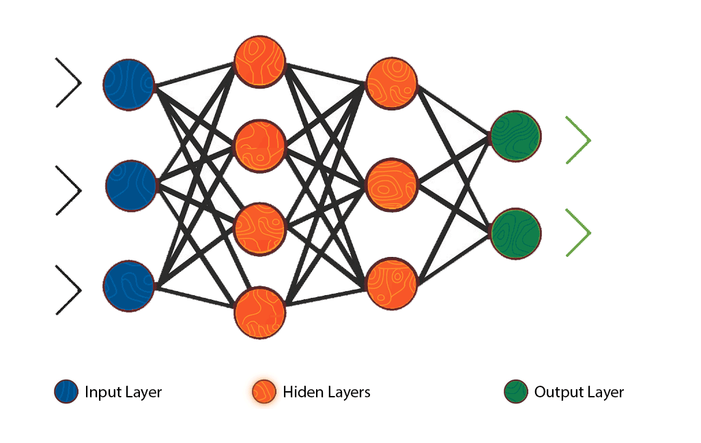

# Objective
We'll train, test and validate a neural network with our labeled credit data (which we add in features names for). The only thing we know about this data is that theres 999 rows and 27 columns (columns are labeled). We also assume that we can place as many neurons in the hidden layer as you like. 

# Introduction
Artificial neural networks are the software implementation of the neuronal structure of our brain. the brain has neurons which can change their output state depending on the strength of their electrical or chemical input. A neural network is a massive interconnected network of neurons. Here is a simple video explaining what a <a href="https://www.youtube.com/watch?v=6qS83wD29PY">neuron</a> is.

We learn by repeatedly activating certain neural connections over others, this reinforces those connections and makes them more likely to preduce a desired outcome given a specified input. This learning involves feedback. By having desired outcomes, the neural connections cause that specific outcome to be more likely. Our networks will attempt to simplify and mimic brain behavior. We can train these networks in a supervised or unsupervised manner. 

The most basic neural network is a perceptron 
</img>  This is An algorithm for supervised learning on binary classifiers. Recall, a supervised learning algorithm is the task of learning a function that maps inputs to ourputs based on past input/outpur pairs. A perceptron is a classification algorithm that makes predictions to be used on a linear predictor function combining a set of weights w/ a feature vector. It learns a binary classifier called a threshold function which maps its input (x - a vector) to an output value (f(x) - a single binary value).

# Neural Networks
Theres many different algorithms for machine learning however the 3 main ones we usually see: Artifical neural network, Convolutional Neural Network, and Recurrent Neural Network. <b>In this example we will be using an Artifical neural network</b>. 

# Artificial Neural Network(ANN)
This type of network can been seen as a group of multiple perceptrons(neurons) at each layer. We can also cateogrize this as a <a href="https://en.wikipedia.org/wiki/Feedforward_neural_network">feed forward network</a>. 
 
ANNs are able to learn just about any nonlinear function; people also call them Universal Function Approximators. They have the capacity to learn weights that map any input to the output. One of the key features about this algorithm is we implement an activation function which introduces nonlinear properties to the network. We consider that our output is the activation of a weighted sum on inputs 
</img>

## Going Through a different example + notes
<a href="./Source-Files">Notes + code</a>

# Install packages
run `pip3 install -r requirements.txt` in the terminal
