# Motivation
Imagine searching for a bug in your code. You create multiple print statements to pinpoint where exactly the bug is. Then you make changes to the code and test it again. You repeat this process until our code successfully again. Neural networks work almost the same. We take multiple inputs, process it through multiple neurons from multiple hidden layers, and return the result using an output layer. This is considered <b>forward propagation<b>. Then we compare the result with the actual output. We aim to make the output to the neural network as close to the actual output (our original data). Note that each neuron will contribute to some error in our final output. We can reduce the error by minimizing the value/weight of neurons that are contributing more to the error and this happens when "traveling back" to the neurons of the nueral network and finding where the error is. This is considered <a href="https://en.wikipedia.org/wiki/Backpropagation"><b>backward propagation</b></a> We can aim to reduce the number of iterations to minimize the error by implementing an algorithm known as <a href="https://en.wikipedia.org/wiki/Gradient_descent"><b>Gradient Descent</b><a/>.
  
# Single Layer Perceptron
Going back on perceptrons, theres a few ways of describing the relationship between input and output. One way of viewing this relationship is seeing that each vector input is associated with a weight and bias (describes how "flexible" a perceptron is). The linear representation of this relationship looks like: `w1*x1 + w2*x2 + w3*x3 + 1*b` 
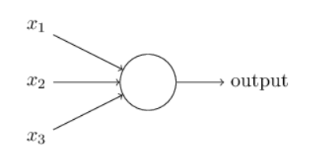</img>
  
## Activation Function
This takes the sum of weighted input `w1*x1 + w2*x2 + w3*x3 + 1*b` as an argument and returns the output of a neuron. theres multiple activiation functions .
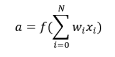</img>
  
## Foreward/backward Propogation and Epochs
What if our estimated output is very far off from the actual output? To solve this we need to update our bias and weights based on the error. This works by determining the loss(error) at the output and then propogate it back to the network. The weights are updated to minimize the error resulting from each neuron. What were essentially doing here is determining the gradient (derivative) of each node. A single round of foreward and back propogation is known as 1 training iteration, an <b>epoch</b>.
  
# Multi Layer Perceptron
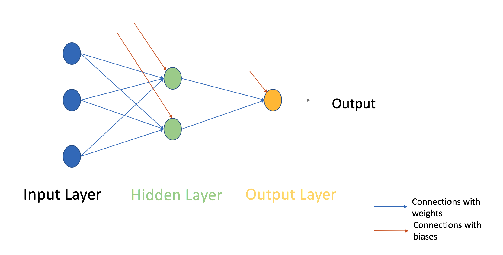</img> 
We could have as many hidden layers as we want in our case. These layers are stacked between the input and output layers. Every node in a layer is connected to every node in the previous layer and the following layer. 

# Gradient Descent
Here we update the weights of our multilayer perceptron. Theres 2 types of gradient descent: Full batch and Stochastic gradient descent. Lets say we have 10 data points with two weights w1 and w2. In Full Batch you can use the entire data set, calculate the change in w1 and the change in w2, and update w1 and w2.

For Stochastic gradient descent: You use the 1st data point and calculate the change in w1 and the change in w2 and update w1 and w2. Next you use the 2nd data point and do the same thing until you do all 10 data points. 

# Methodology (Multi-layer Perceptron w/ 1 layer)
Going back to the image above; at the output layer, we have only one neuron as we are solving a binary classification problem (predict 0 or 1). 

<ol>
  <li>X is our input matrix and Y is out output matrix</li> 
  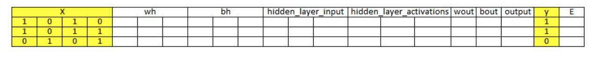</img> 
  <li>Initialize weights and biases with random values 
  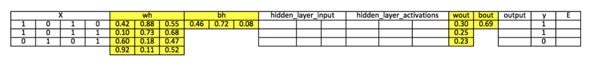</img>
    We can define 
    <ul>
      <li>"wh" as a weight matrix to the hidden layer</li>
      <li>"bh" as a weight matrix to the hidden layer</li>
      <li>"wout" is a weight matrix to the output layer</li>
      <li>"bout" as a bias matrix to the output layer</li>
    </ul>
  <li>Take the matrix dot product of input and weights assigned to edges between the input and hidden layer, then add bias of the hidden layer neurons to the respective inputs, this is known as linear transformation.
  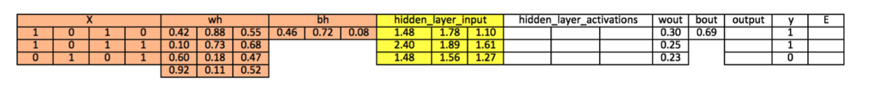</img> 
    <ul>
      <li>`hidden_layer_input = matrix_dot_product(X, wh) + bh`</li>
    </ul>
  </li>
  <li>Perform non linear transformation using an activation function (Sigmoid). This will return the output as: `1/(1 + exp(-x))` 
  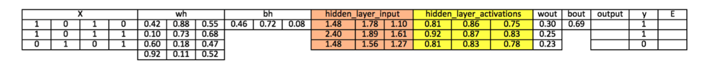</img> 
    <ul>
      <li>`hiddenLayer_activations = sigmoid(hidden_layer_inout)`</li>
      <li>`output = sigmoid(output_layer_input)`</li>
    </ul>
  </li>
  <li>Then perform a linear transformation on the hidden layer activation (take the matrix dot product w/ weights and add bias of the output layer neuron) then apply an activation function (sigmoid?) to predict the output.</li>
  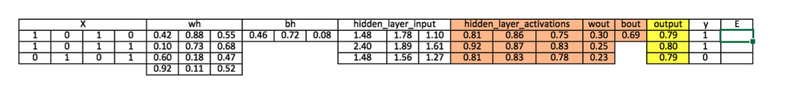</img>
  <ul>
    <li>`output_layer_input = matrix_dot_product(hiddenLayer_activations * wout) + bout`</li>
  </ul>
  </li>
  <li>Compare our prediction with the actual output (for our example this would be the last 20 datasets) and calculate the gradient of error (Actual - Predicted). Error is the <b>Mean square loss = ((Y-t)^2/2</b></li>`E = y - output`
  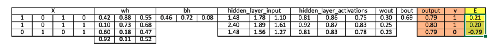</img>
  <li>Compute the slope/gradient of hidden and output layer neurons (To compute the slope, we calculate the derivatives of non-linear activations x at each layer for each neuron). The gradient of sigmoid can be returned as x * (1 - x)</li> 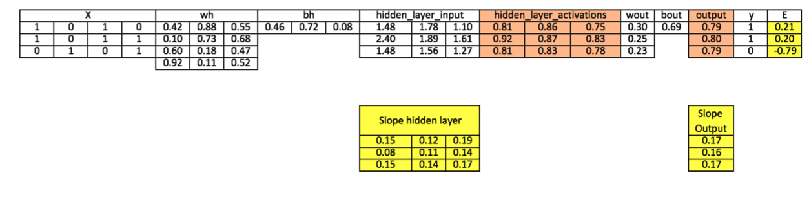</img> <ul><li> `slope_output_layer = derivatives_sigmoid(output)` </li></ul><ul><li>`slope_hidden_layer = derivatives_sigmoid(hiddenlayer_activations)`</li></ul>
<li>Compute the change factor(delta) at the output layer</li> <ul><li>`d_output =E * slope_output_layer`</ul></li>
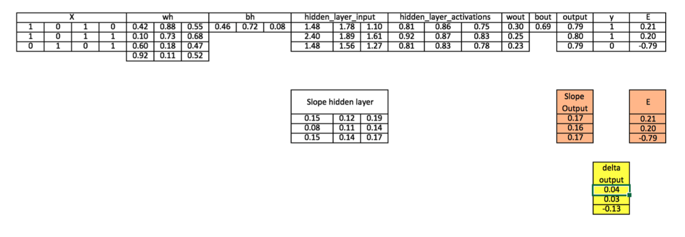</img>
<li>The error will propogate back into the network. We can take the dot product of the output layer delta with the weight parameters of edges between the hidden and output layer 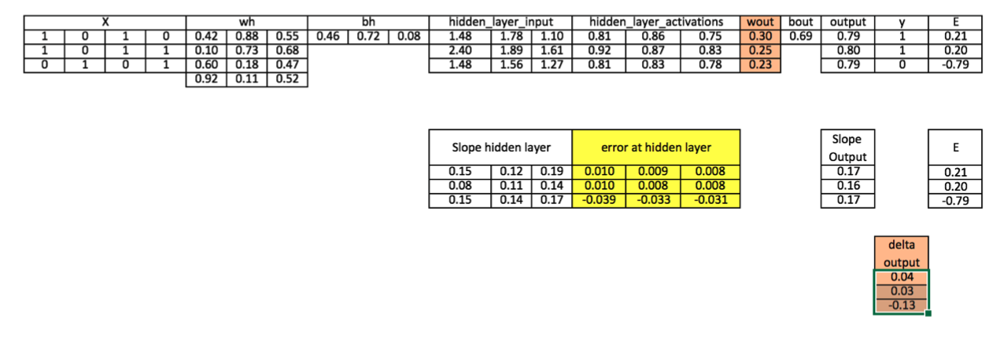</img><ul><li>`wout.T`</ul></li></li>
<li>Computer change factor(delta) at the hidden layer. 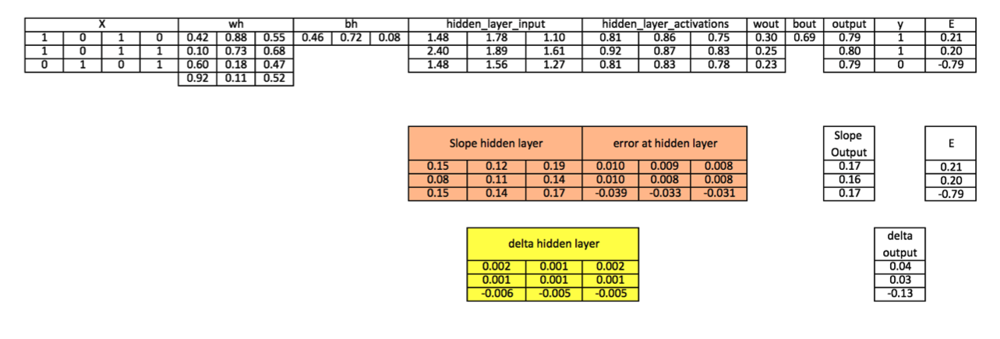</img></li> <ul><li>`wout = wout + matrix_dot_product(hiddenlayer_activations.Transpose, d_output)*learning_rate`</ul></li>
<ul>
  <li>`wh = wh + matrix_dot_product(X.Transpose, d_hiddenlayer)*learning_rate`</li>
  <li>The learning rate is the amount that weights are updated</li>
</ul>
<li>
  Update the biases at the output and hidden layer: the biases in the network can be updated from the aggregated errors at that neuron
  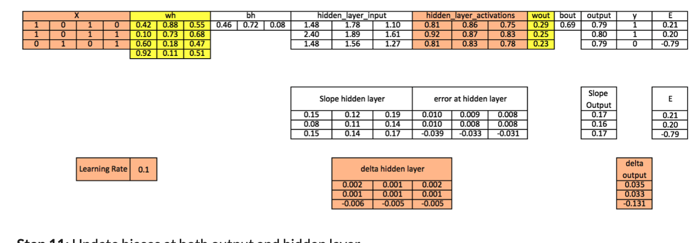</img>
  <ul>
    <li>bias at output layer = bias at output layer + sum of delta of output layer at row wise * learning rate</li>
    <li>bias at hidden layer = bias at hidden layer + sum of delta of output layer at row wise * learning rate</li>
  </ul>
</li>
</ol>
